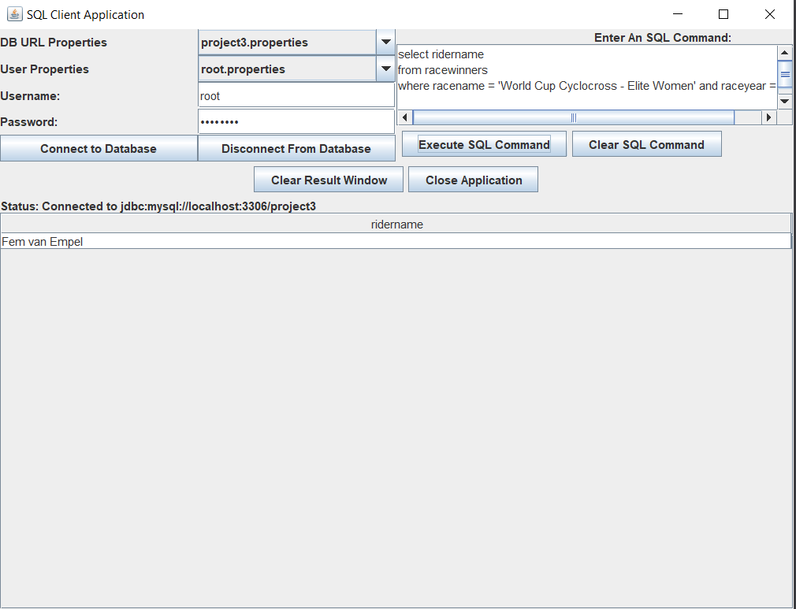

# Two-Tier Client–Server Application Using MySQL and JDBC
*Java • JDBC • MySQL • Swing GUI • Client–Server Architecture*

This project was developed as part of **CNT 4714 (Enterprise Computing)** and implements a **two-tier Java client–server application** that allows multiple clients to execute SQL commands against a remote MySQL database using JDBC.

The application enforces **role-based permissions**, supports **multiple simultaneous client connections**, and logs all successful database operations to a separate operations database.

---

## Project Overview
The system consists of **two Java applications**:

1. **SQL Client Application**
   - A GUI-based client that allows authorized users to execute SQL **DDL and DML** commands.
   - Supports multiple user roles with different database permissions.
   - Displays query results and command execution status in real time.

2. **Accountant Application**
   - A restricted client that can only query the **operations logging database**.
   - Used to monitor aggregate database usage statistics across all users.

This project demonstrates a classic **two-tier client–server model**, where a Java client communicates directly with a database server using JDBC.

---

## Key Features

### Client–Server Interaction
- Java client connects to a remote **MySQL database server** using JDBC.
- Multiple client instances can run simultaneously.
- Database connections are configured through **properties files**.

### Role-Based Access Control
- Multiple MySQL users with restricted privileges:
  - **Root user:** full database access
  - **Client users:** limited SELECT / UPDATE permissions
  - **Accountant user:** read-only access to the logging database
- Application verifies GUI-entered credentials against selected properties files before establishing a connection.

### SQL Execution
- Supports execution of:
  - `SELECT` queries using `executeQuery()`
  - `INSERT`, `UPDATE`, and DDL commands using `executeUpdate()`
- Displays result sets for queries and status messages for non-query commands.
- Handles SQL errors and permission violations gracefully.

### Operations Logging
- All **successful SQL operations** are logged automatically.
- Logging data is stored in a separate `operationslog` database.
- Tracks the number of queries and updates executed by each user.
- Logging is performed using a dedicated application-level database account.

### Graphical User Interface
- Java Swing GUI includes:
  - SQL command input window
  - SQL execution results window
  - Database connection status display
  - Buttons to connect, disconnect, execute commands, clear fields, and exit
- Supports reconnecting as different users without restarting the application.

---

## Technologies Used
- **Java**
- **JDBC**
- **MySQL**
- **Java Swing**
- **SQL**
- **Properties files for configuration**

---

## Screenshots



---

## Project Structure

```text
.
├── src/
│   ├── SQLClientApp.java
│   ├── AccountantApp.java
│   ├── ResultSetTableModel.java
│   ├── DBUtilities.java
│   └── (additional Java source files)
├── properties/
│   ├── project3.properties
│   ├── bikedb.properties
│   ├── root.properties
│   ├── client1.properties
│   ├── client2.properties
│   ├── project3app.properties
│   └── theaccountant.properties
├── sql-scripts-provided/
│   ├── bikedbscript.sql
│   ├── project3dbscript.sql
│   ├── project3operationslog.sql
│   ├── clientCreationScriptProject3.sql
│   ├── clientPermissionsScriptProject3.sql
│   ├── project3rootscript.sql
│   ├── project3client1script.sql
│   └── project3client2script.sql
├── screenshots/
└── README.md
